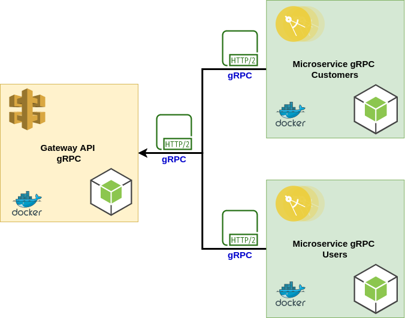

## Gateway API and gRPC microservice with Typescript

Gateway API and gRPC microservice example of crud with typescript and nodejs

    

#### 1. Requirements Installation

* Install docker
* Install docker-compose

#### 2.  Steps to run this project

##### 2.1. Start project in mode development

* To create proto interfaces in the project gRPC microservices, use the script `script/protoc.sh`
    
    `yarn protoc`
    
* To start project using docker
        
    `docker-compose up --build`
        
    * note: if start project in mode `production` change the script `docker/nodejs/entrypoint-server.sh`:
        
        from `yarn dev` to ` yarn build && yarn start`
 
       
##### 2.2. Testing the Gateway API gRPC

   * Access gateway api in `http://localhost:3005`
    
        | METHOD | SERVICES |
        | ---  | --- |
        | GET  | /customers |
        | GET  | /customers/12385 |
        | POST | /customers |
        | PUT  | /customers |
        | DELETE | /customers/12385 |
        | GET  | /users |
        | GET  | /users/47 |
        | POST | /users |
        | PUT  | /users |
        | DELETE | /users/6 |
        | POST | /users/login |
        
        
##### 2.3. Testing the gRPC Microservices using BloomRPC

* To install BloomRPC access the [guide](https://github.com/uw-labs/bloomrpc)
* Access Microservice Customers gRPC in `127.0.0.1:50051`
* Access Microservice Users gRPC in `127.0.0.1:50052`

