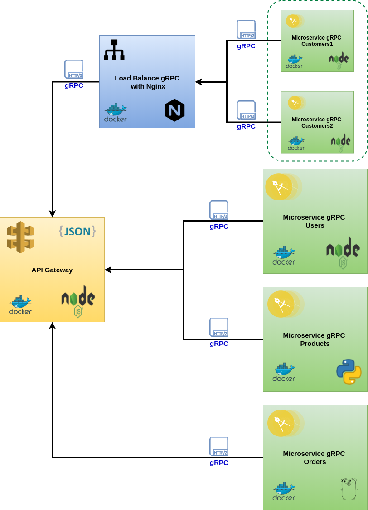

## Gateway API and gRPC microservices with NodeJs, Python and Golang

Gateway API and microservices in gRPC with nodejs, python and golang. Examples for study purposes.

    

#### 1. Requirements Installation

* Install docker
* Install docker-compose
* Install Makefile

#### 2.  Steps to run this project

##### 2.1. Start project in mode development

* Copy file `docker-compose.override.dist.yml` with name `docker-compose.override.yml`
    
    * Configure the environments: `API_KEY` is optional to monitor with amplify nginx

* To create proto interfaces in the project gRPC microservices in nodejs and python, use the script `script/protoc.sh`    

* To start project using docker use the commands

    | COMMAND | DESCRIPTION |
    | ---  | --- |
    | make dev  | Execute all application in mode development |
    | make dev-grpc-customers  | Execute grpc-customers application in mode development |  
    | make dev-grpc-users  | Execute grpc-users application in mode development |      
    | make dev-grpc-products  | Execute grpc-products application in mode development |  
    | make dev-grpc-orders  | Execute grpc-orders application in mode development |
    | make lint-fix-gateway-api  | Execute command `yarn lint:fix` in gateway api |  
    | make protoc-grpc-customers  | Execute command `yarn protoc` to app-customers |  
    | make protoc-grpc-users  | Execute command `yarn protoc` to app-users |   
    | make protoc-grpc-products  | Execute command `script/protoc.sh` to app-products |
    | make nginx-start HOST_NAME=NGINX-01  | Execute nginx-grpc application using hostname |
          
          
   
   
  
* note: if start project nodejs in mode `production` change the script `docker/nodejs/entrypoint-server.sh`
        
     from `yarn dev` to ` yarn build && yarn start`
 
       
##### 2.2. Testing the Gateway API gRPC

   * Access gateway api in `http://localhost:3005`
    
        | METHOD | SERVICES |
        | ---  | --- |
        | GET  | /customers |
        | GET  | /customers/12385 |
        | POST | /customers |
        | PUT  | /customers |
        | DELETE | /customers/12385 |
        | GET  | /users |
        | GET  | /users/47 |
        | POST | /users |
        | PUT  | /users |
        | DELETE | /users/6 |
        | POST | /users/login |
        | GET  | /products |
        | GET  | /products/3 |
        | POST | /products |
        | PUT  | /products |
        | DELETE | /products/5 |
        | GET  | /orders |
        | POST | /orders |
        
        
##### 2.3. Testing the gRPC Microservices using BloomRPC

* To install BloomRPC access the [guide](https://github.com/uw-labs/bloomrpc)
* Access Microservice Customers gRPC in `127.0.0.1:50051`
* Access Microservice Users gRPC in `127.0.0.1:50052`
* Access Microservice Products gRPC in `127.0.0.1:50053`
* Access Microservice Orders gRPC in `127.0.0.1:50054`

##### 3. Reference

* What is gRPC [guide](https://grpc.io/docs/guides/)
