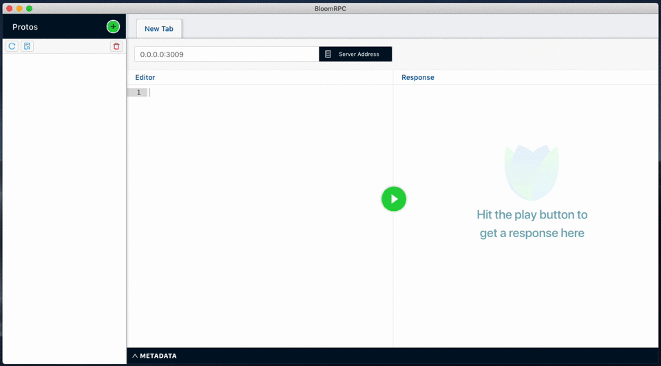

# grpc-api-typescript
gRPC example of crud with typescript and nodejs

#### 1. Requirements Installation

* Install docker
* Install docker-compose
* Install make

#### 2.  Steps to run this project:

##### 2.1. Start project in mode development

* To create proto interfaces in the project, use the bash command in the `script` folder:
    `yarn protoc`
    
* To start project using docker:
        
    `docker-compose up --build`
        
    * note: if start project in mode `production` change the script `docker/nodejs/entrypoint-server.sh`:
        
        from `yarn dev` to `yarn start`
        

##### 2.2. Testing the gRPC API using BloomRPC

* To install BloomRPC access the [guide](https://github.com/uw-labs/bloomrpc)

